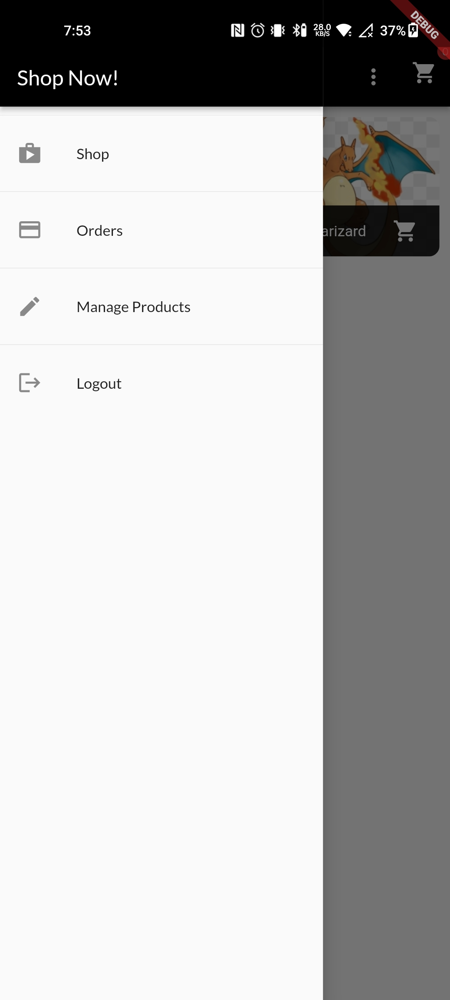
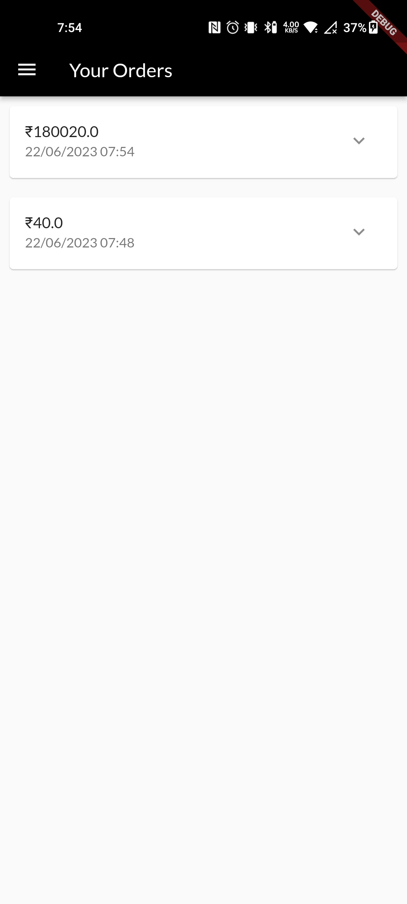
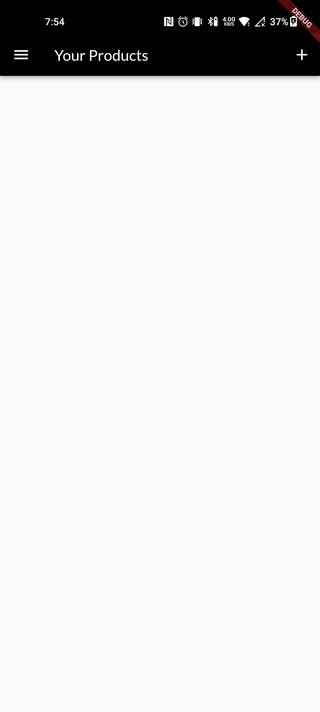

# Flutter Shop App

<p>
  
  <br>
  <em>Users can easily signup and login with their gmail and password.</em>
</p>


Welcome to the Flutter Shop App repository! This is a powerful and customizable e-commerce application built with Flutter, designed to provide a seamless shopping experience for your users. Whether you're starting a new online store or looking to enhance your existing Flutter project, this app is a perfect fit.

## Features

- **User authentication**: Secure user registration and login to personalize the shopping experience.
- **Product catalog**: Browse and search for a wide range of products with detailed descriptions and images.
- **Shopping cart**: Add products to the cart, update quantities, and proceed to checkout.
- **Order management**: Track and manage orders, view order history, and receive notifications.
- **Favorites**: Save favorite products for quick access and future purchases.
- **Product reviews**: Read and write product reviews to help users make informed decisions.
- **Payment integration**: Seamlessly integrate popular payment gateways to process transactions securely.
- **User profiles**: Manage personal information, addresses, and payment methods.
- **Wishlist**: Create and manage a wishlist of desired products.
- **Product recommendations**: Generate personalized product recommendations based on user preferences.
- **Responsive design**: Optimal user experience across various devices and screen sizes.

## Screenshots

Here are some screenshots of the Flutter Shop App in action:


<p>
  
  <br>
  <em>The home screen displays featured products and categories for easy navigation.</em>
</p>

<p>
  
  <br>
  <em>The drawer displays featured products and categories for easy navigation.</em>
</p>

<p>
  
  <br>
  <em>Order History screen so that user can see their past orders.</em>
</p>

<p>
  
  <br>
  <em>The Order History Screen to Order the items which you have bought.</em>
</p>

<p>
  
  <br>
  <em>Being a fan of Pokemon I have Charizard as my Porduct.</em>
</p>

<p>
  
  <br>
  <em>Pokeball is my another Product.</em>
</p>

<p>
  
  <br>
  <em>You can mark your products favourite and use the filter to see only fav. prods.</em>
</p>

<p>
  
  <br>
  <em>You can add your OWN PRODUCT so that others can buy it.</em>
</p>

<p>
  
  <br>
  <em>Just tap on the number of times for which you want to buy the items.</em>
</p>


## Getting Started

To get started with the Flutter Shop App, follow these steps:

1. Clone this repository to your local machine.
   ```shell
   git clone https://github.com/your-username/flutter-shop-app.git
   ```

2. Navigate to the project directory.
   ```shell
   cd flutter-shop-app
   ```

3. Install the necessary dependencies using Flutter's package manager, **pub**.
   ```shell
   flutter pub get
   ```

4. Run the app on a connected device or emulator.
   ```shell
   flutter run
   ```

## Contributing

Contributions to the Flutter Shop App are welcome and encouraged! If you find any bugs, have feature requests, or want to contribute in any other way, please open an issue or submit a pull request. We appreciate your help in making this app better.

## License

This project is licensed under the [MIT License](LICENSE). Feel free to use and modify the code to suit your needs.

## Acknowledgements

We would like to express our gratitude to the Flutter community for their continuous support and the developers of the libraries and packages used in this app.

If you have any questions or need further assistance, please feel free to contact me.

<div align="center">
  <a href="https://twitter.com/ShirkeAryan2234/" target="_blank">
    
  </a>
  <a href="https://www.linkedin.com/in/aryan-shirke/" target="_blank">
    
  </a>
</div>

Happy shopping!
